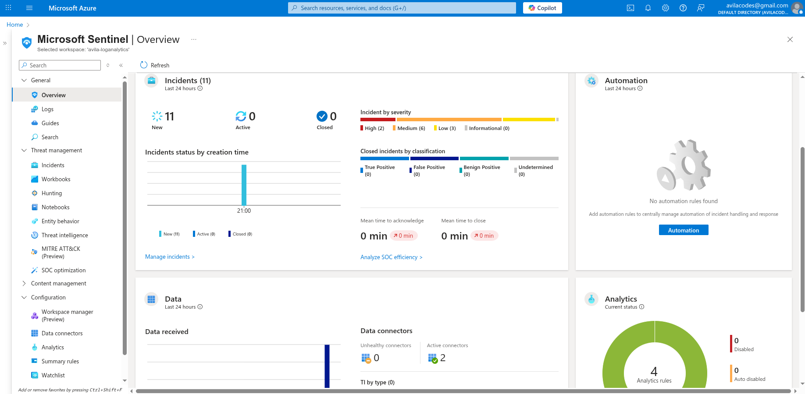
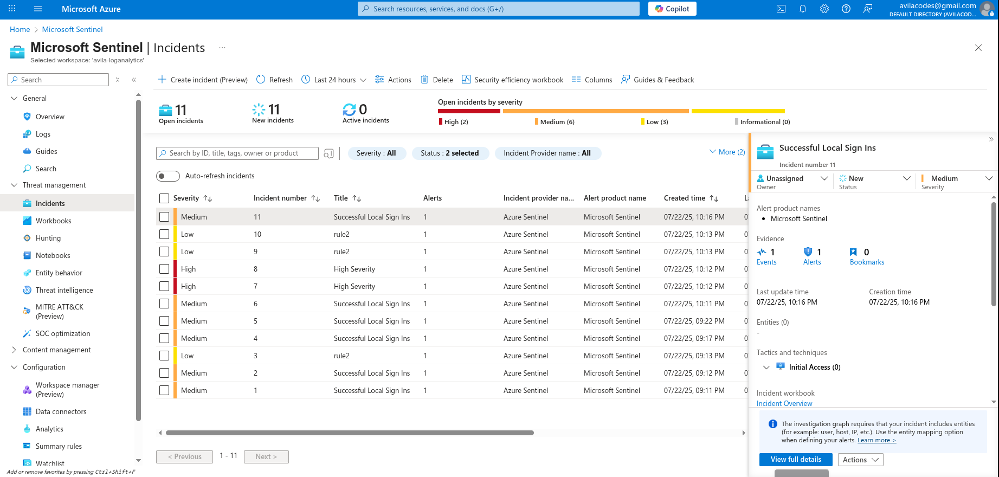

 # security-operations-center-lab          
 
## Overview

This SOC Lab is designed to simulate a realistic cybersecurity defense environment to build hands-on skills in monitoring, detection, and incident response. The lab leverages open-source and commercial tools to provide experience with Security Information and Event Management (SIEM), log aggregation, rule-based detection, and alerting.

**Purpose:**  
- To provide a practical environment for learning SOC analyst skills  
- To understand SIEM deployment and use in enterprise threat detection  
- To practice parsing logs, writing detection rules, and investigating alerts  

**Tools Used:**    
- Virtualization: VMware Workstation / VirtualBox  
- Operating Systems: Windows Server, Windows 10/11 clients  
- Log Forwarding: Beats agents / Winlogbeat / Syslog    

## Setup Instructions

1. **Deploy Virtual Machines**  
   - Deploy Windows Server and client VMs and Linux machines on VirtualBox or VMware Workstation  
   - Configure network adapters in Host-Only or NAT mode for communication  

2. **Install SIEM**  
   - Download and install your chosen SIEM on a dedicated VM  
   - Configure initial indexing and user roles  

3. **Log Forwarding Configuration**  
   - Install log forwarders (Winlogbeat for Windows, Filebeat for Linux) on endpoint VMs  
   - Configure forwarders to send logs to SIEM’s intake ports  

4. **Configure Log Parsing and Indexes**  
   - Set up source types and index configurations in SIEM  
   - Test logs ingestion with sample data  

5. **Detection Rules and Content**  
   - Import or write detection rules to trigger alerts for suspicious activities   
   - Enable dashboards and alerts to surface analytic insights    

## Sample Use Cases / Exercises

- Detecting brute force login attempts on Windows servers  
- Monitoring PowerShell execution events for suspicious scripts  
- Tracking unusual network activity or data exfiltration attempts  
- Alerting on creation of new administrative users  
- Investigating alerts using SIEM dashboards and search queries  

## Troubleshooting & Common Issues

- **Log forwarding not working:**  
  - Check network connectivity between forwarder and SIEM  
  - Verify correct port numbers and firewalls are open  
  - Review forwarder config files for syntax errors  

- **SIEM not parsing logs correctly:**  
  - Confirm correct source types and parsing rules exist  
  - Use SIEM tools to inspect raw events for inconsistencies  

- **No alerts triggered:**  
  - Confirm detection rules are activated and enabled  
  - Review alert conditions and tune thresholds  

- **Performance issues:**  
  - Allocate sufficient CPU and RAM to VMs  
  - Adjust indexing intervals or reduce ingested data volume  
